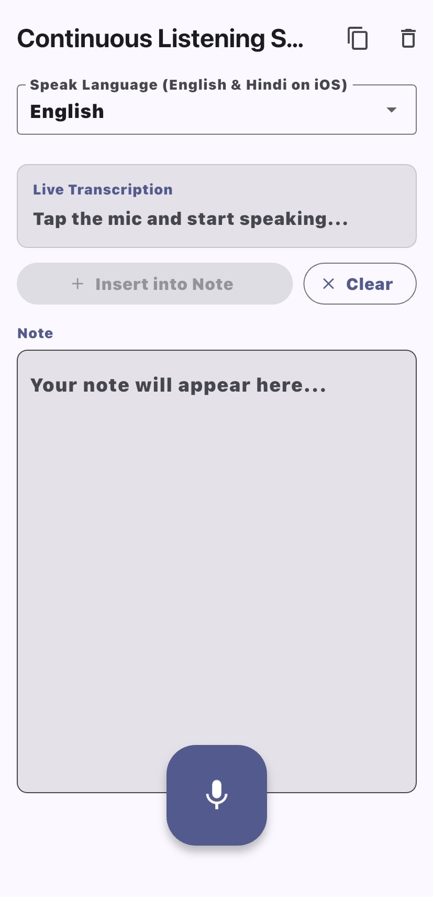

# continuous_listening_stt

**continuous_listening_stt** is a Flutter demo app showcasing **continuous speech-to-text** on both **Android and iOS** using the [`speech_to_text`](https://pub.dev/packages/speech_to_text) package — including a complete fix for the **Android 15 beep sound** and the **duplicate text** problem that occurs at session boundaries.


📖 **Full Article:** [A complete guide to hands-free note taking on Android & iOS using the speech_to_text package with Continuous Listening for both android & ios](https://medium.com/@surajpatil05/a-complete-guide-to-hands-free-note-taking-on-android-ios-using-the-speech-to-text-package-with-4050b4a2e96e)

## 📲 Screenshots

### 🤖 Android & 🍎 iOS

<p align="center">
  
</p>

## 🚀 Features

- ✅ **Continuous listening on Android** via auto-restart loop — keeps mic alive indefinitely
- ✅ **Continuous listening on iOS** via `AVAudioEngine` — native, no restart needed
- ✅ **Android 15 beep suppression** — manifest fix + 300ms audio mute before every `speech.listen()`
- ✅ **Word-level overlap deduplication** — eliminates duplicate text at session boundaries
- ✅ **13 Indian languages on Android** — English, Hindi, Telugu, Tamil, Kannada, Malayalam, Marathi, Gujarati, Bengali, Punjabi, Urdu, Odia, Assamese
- ✅ **English + Hindi on iOS** — iOS `SFSpeechRecognizer` limitation
- ✅ **Live transcription box** — real-time partials as you speak
- ✅ **Manual Insert into Note** — editor only fills when you tap the button
- ✅ **Copy to clipboard**
- ✅ **Permission handling** with Settings redirect on permanent denial

## ❓ The Problem This Solves

### 🤖 Android: No Native Continuous Listening

Android's `SpeechRecognizer` was designed for short voice commands. It kills the session after **2–5 seconds of silence** — there is no official API to disable this. This demo implements a **restart loop** that detects session end via `onStatus` / `onError` callbacks and immediately restarts, giving the illusion of continuous listening.

### 🔔 Android 15: The Beep Problem

On Android 15 (tested on **Realme P3 / ColorOS**), every call to `speech.listen()` triggers an audible beep through `STREAM_SYSTEM`. When auto-restarting every few seconds, this becomes a rapid-fire beep — completely unacceptable for a note-taking app.

**The fix has two layers:**

- **Manifest** — disable the Google Speech service entry to prevent it playing its own beep at the service level
- **Audio muting** — mute `STREAM_SYSTEM` before every `speech.listen()` call, with a **critical 300ms delay** to allow the audio subsystem to process the mute before the beep fires

> ⚠️ **100ms is NOT enough.** Testing confirmed 300ms is the minimum delay on Android 15. The audio subsystem needs time to apply the mute command before `speech.listen()` initialises and the beep triggers.

### 🔁 Android: Duplicate Text at Session Boundaries

When a new session starts, Android's STT engine **echoes the last few words** of the previous session at the start of the new session's results. Naive accumulation causes duplicates like:

```
"how are you doing"
"how are you doing how are you doing great"  ← duplicate ❌
```

This demo uses **word-level overlap detection** to strip the echo prefix before committing new words, eliminating duplicates entirely. ✅

### 🍎 iOS: AVAudioEngine — Continuous by Default

iOS uses `AVAudioEngine` under the hood, which keeps the audio session alive natively through silences. **No restart loop needed.** Apple imposes a ~1 minute hard session limit, after which we restart once — but this is rare and seamless.

## 📱 Platform Requirements

|                 | Android                         | iOS                  |
| --------------- | ------------------------------- | -------------------- |
| Minimum version | Android 5.0 (API 21)            | iOS 13.0             |
| Internet        | Required (Google STT)           | Required (Apple STT) |
| Tested on       | Realme P3, Android 15 (ColorOS) | iPhone (iOS 17+)     |

## 🛠 Installation

### 1. Clone and install dependencies

```bash
git clone https://github.com/YOUR_USERNAME/continuous_listening_stt.git
cd continuous_listening_stt
flutter pub get
```

### 2. iOS — install pods

```bash
cd ios
pod install
cd ..
```

> Requires CocoaPods. Install with `sudo gem install cocoapods` if not present.
> Minimum iOS deployment target must be **13.0** — set in `ios/Podfile` and Xcode target settings.

### 3. Run

```bash
flutter run
```

## ⚙️ Android Configuration

### `AndroidManifest.xml`

Two critical additions beyond the standard Flutter manifest:

```xmlV
<!-- Runtime permissions -->
<uses-permission android:name="android.permission.RECORD_AUDIO"/>
<uses-permission android:name="android.permission.INTERNET"/>

<!-- Disables Google Speech service to prevent beep at source on Android 15 -->
<service
  android:name="com.google.android.gms.speech.service.SpeechRecognitionService"
  android:enabled="false"
  tools:node="remove"/>
```

The `xmlns:tools` namespace must also be added to the `<manifest>` tag:

```xml
<manifest xmlns:android="http://schemas.android.com/apk/res/android"
          xmlns:tools="http://schemas.android.com/tools">
```

### `MainActivity.kt` — Platform Channel for Audio Muting

A `MethodChannel` bridges Dart and Android's `AudioManager` to mute/unmute system sounds around every `speech.listen()` call:

```kotlin
MethodChannel(flutterEngine.dartExecutor.binaryMessenger, "stt_audio_channel")
    .setMethodCallHandler { call, result ->
        when (call.method) {
            "muteSystemSound" -> {
                try {
                    audioManager.setStreamVolume(AudioManager.STREAM_SYSTEM, 0, 0)
                    audioManager.adjustStreamVolume(
                        AudioManager.STREAM_SYSTEM, AudioManager.ADJUST_MUTE, 0)
                } catch (e: SecurityException) {
                    // Some OEMs restrict volume changes — safe to ignore
                }
                result.success(null)
            }
            "unmuteSystemSound" -> {
                // Restore original volumes
                result.success(null)
            }
        }
    }
```

> 💡 The `try-catch` is essential. On MIUI/Xiaomi, muting `STREAM_NOTIFICATION` or `STREAM_RING` throws a `SecurityException` (Do Not Disturb policy). Only mute `STREAM_SYSTEM` and always wrap in try-catch.

## ⚙️ iOS Configuration

### `Info.plist`

```xml
<key>NSMicrophoneUsageDescription</key>
<string>This app needs microphone access for speech-to-text note taking.</string>
<key>NSSpeechRecognitionUsageDescription</key>
<string>This app uses speech recognition to transcribe your spoken notes.</string>
```

### Permission Handling

On iOS, **do not use `permission_handler` before `speech.initialize()`**. The `speech_to_text` package calls `SFSpeechRecognizer.requestAuthorization` and `AVAudioSession` internally. Calling `permission_handler` before it causes a race condition — iOS returns denied because the permission system is called twice in the same cycle.

```dart
// ✅ Correct — let speech_to_text handle iOS permissions internally
_isInitialized = await _speech.initialize(...);

// ❌ Wrong — causes conflict on iOS
final status = await Permission.microphone.request(); // do NOT do this on iOS
```

## 💡 Key Implementation

### The Restart Loop (Android only)

```dart
_isInitialized = await _speech.initialize(
  onStatus: (status) {
    if (Platform.isAndroid &&
        _isListening &&
        (status == 'done' || status == 'notListening')) {
      _restartListening(); // ← restart immediately on Android
    } else if (Platform.isIOS && status == 'done') {
      _restartListening(); // ← restart only at Apple's ~1 min limit
    }
  },
  onError: (error) {
    if (Platform.isAndroid && _isListening) {
      _restartListening();
    }
  },
);
```

### The Beep Fix (Android 15)

```dart
Future<void> _startListenSession() async {
  if (Platform.isAndroid) {
    await _audioChannel.invokeMethod('muteSystemSound');
    await Future.delayed(const Duration(milliseconds: 300)); // ⭐ CRITICAL
    // 100ms is NOT enough — the audio subsystem needs 300ms to apply the mute
    // before speech.listen() initialises and the beep fires.
  }
  await _speech.listen(...);
}
```

### Word-Level Overlap Deduplication

```dart
// Finds the longest suffix of committedText that matches a prefix of incoming,
// then appends only the non-overlapping tail.
//
// Example:
//   committed : "capture the words properly and do not append new"
//   incoming  : "and do not append new words"   ← Android echo tail
//   overlap   : "and do not append new"  (5 words)
//   appended  : "words"  ✅
String _commitWithOverlapCheck(String incoming) { ... }
```

## 📂 Project Structure

```
lib/
├── main.dart            # UI — language selector, live transcription box, note editor
└── speech_service.dart  # Core STT logic — restart loop, beep fix, deduplication

android/
└── app/src/main/
    ├── AndroidManifest.xml          # Permissions + Google Speech service disable
    └── kotlin/.../MainActivity.kt   # Platform channel for audio muting

ios/
└── Runner/
    └── Info.plist       # Microphone + Speech Recognition usage descriptions
```

## 📦 Dependencies

| Package              | Version | Purpose                        |
| -------------------- | ------- | ------------------------------ |
| `speech_to_text`     | ^7.3.0  | Core STT engine                |
| `permission_handler` | ^12.0.1 | Android runtime mic permission |

## ⚠️ Known Limitations

- **Android background listening** — Android kills background services aggressively. Continuous listening only works reliably while the app is in the foreground.
- **iOS language support** — Only English and Hindi are reliably supported by iOS `SFSpeechRecognizer`. Other Indian languages are not available on iOS.
- **Android offline** — Google STT requires an internet connection unless the user has downloaded an offline language pack in device settings.
- **OEM variation** — The beep fix was validated on Realme P3 (ColorOS, Android 15). On Samsung One UI or Xiaomi MIUI, audio routing may differ slightly. The `try-catch` in `MainActivity.kt` handles permission-restricted OEMs gracefully.
